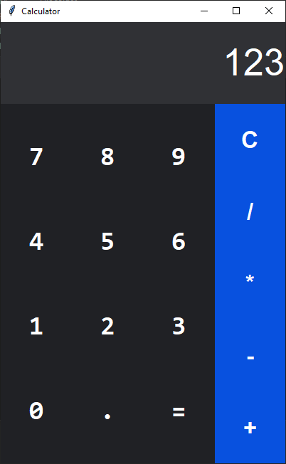

# Python Calculator App
Google calculator clone made in python using `Tkinter` module.

### Python Dependencies:

-   [`asteval` package](https://pypi.org/project/asteval/) (ASTEVAL provides a numpy-aware, safe(ish) ‘eval’ function)

Install the above python dependency using the following command

    pip install -r requirements.txt